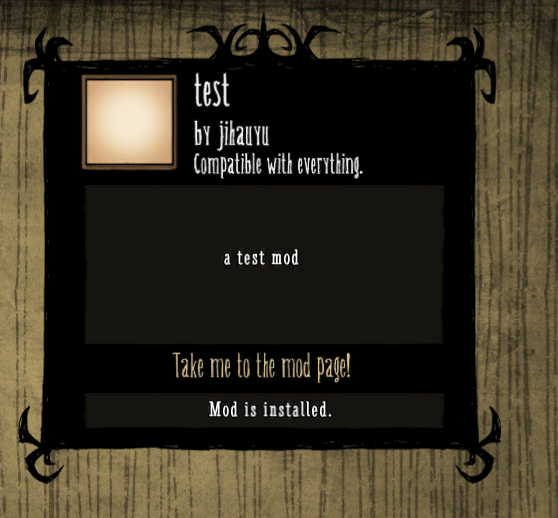
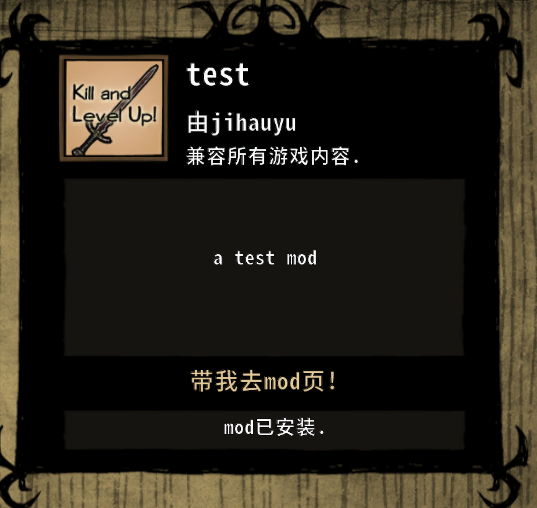

# 饥荒mod制作（day1）
----
## 创建一个mod
1. 找到饥荒安装目录（`\steam\steamapps\common\dont_starve`）。
2. 打开`mods`文件夹。
3. 创建一个新的文件夹，如：`test`。
4. 在文件夹里创建一个文件，`modinfo.lua`。
5. 打开`modinfo.lua`，输入以下内容：
``` lua
name = "test"

description = "a test mod"

author = "jihuayu"

version = "0.1.0"

api_version = 6

dont_starve_compatible = true
reign_of_giants_compatible = true
shipwrecked_compatible = true
hamlet_compatible = true

restart_required = false

standalone = false 

icon_atlas = ""
icon = ""

forumthread = ""

```
- 上面依次是：
    - mod名字:
    - 介绍:
    - 作者:
    - mod版本:
    - API版本
    - 兼容性:分别为原版，RoG，SW，Hamlet的支持
    - 加载mos是否需要重启：
    - 是否只能单独选中：开了这mod还能开其他mod吗？
    - mod图标：
    - mod发布论坛页面地址
6. 至此你创建了你的第一个mod，虽然他什么都没有。

### 效果如下：


7. 给mod添加贴图：把贴图文件复制到mod根目录（包括`.tex`和`.xml`）
8. 填写配置文件：

```lua  
icon_atlas = "modicon.xml"
icon = "modicon.tex"
```

### 效果如下：
