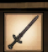
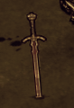

# 饥荒mod制作（day3）
----
## 创建第一个物品
- 在接下去的笔记中我们会用到Growing Sword Lite这个mod作为例子，它可以在[steam上下载到](https://steamcommunity.com/sharedfiles/filedetails/?id=1561182178)
1. 在`test`目录下创建一个`scripts`，在`scripts`文件夹中再创建一个`prefabs`文件夹。
2. 在`prefabs`文件夹中创建一个文件`testitem.lua`.
3. 打开`testitem.lua`，输入以下内容：

```lua
local assets= --加载需要的资源
{ 
    Asset("ANIM", "anim/growingswordlite.zip"),
    Asset("ANIM", "anim/swap_growingswordlite.zip"), 

    Asset("ATLAS", "images/inventoryimages/growingswordlite.xml"),
    Asset("IMAGE", "images/inventoryimages/growingswordlite.tex"),
}

local function fn(sim)

    local inst = CreateEntity() --创建实体
    local trans = inst.entity:AddTransform()  -- 创建位置
    local anim = inst.entity:AddAnimState()  -- 创建动画引擎
    inst.entity:AddSoundEmitter() -- 添加声音引擎
    MakeInventoryPhysics(inst) -- 添加物理引擎
    
    anim:SetBank("wand") -- 添加播放动画
    anim:SetBuild("growingswordlite")
    anim:PlayAnimation("idle")

    inst:AddComponent("inventoryitem") -- 添加物品组建
    inst.components.inventoryitem.atlasname = "images/inventoryimages/growingswordlite.xml" -- 设置物品栏图标图层
    inst.components.inventoryitem.imagename = "growingswordlite"  ---- 设置物品栏图标

    return inst
end

return  Prefab("common/inventory/growingswordlite", fn, assets) -- 注册物品
```

4. 在mod中注册物品：在modmain.lua文件中输入

```lua
PrefabFiles = {
    "growingswordlite",
}
```
5. 进入游戏在控制台输入`c_give("growingswordlite")`
### 效果如下：
 在物品栏的样子
 在地上的样子