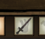

# 饥荒mod制作（day4）
---- 

## 创建第一个装备
1. 打开我们写一半的`growingswordlite.lua`,继续书写。
2. 在函数`fn`中添加内容：

```lua
    inst:AddComponent("equippable") -- 给物品添加装备属性
```

### 效果如下：
 在装备栏的样子
 但是人物手中依旧没有物品

3. 给人物添加手中的物品，在刚刚添加的内容之后添加：

```lua
inst.components.equippable:SetOnEquip(onEquip) -- 当装备装备时触发
inst.components.equippable:SetOnUnequip(onUnequip) -- 当脱下装备时触发
```
4. 我们再写一下`onEquip`,`onUnequip`这两个函数：

```lua
local function onEquip(inst, owner) 
    owner.AnimState:OverrideSymbol("swap_object", "swap_growingswordlite", "wand") 
    owner.AnimState:Show("ARM_carry")
    owner.AnimState:Hide("ARM_normal")
end

local function onUnequip(inst, owner) 
    owner.AnimState:Hide("ARM_carry") 
    owner.AnimState:Show("ARM_normal") 
end
```

### 效果如下：
 在人物手中的样子