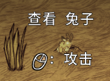

# 饥荒mod制作（day5）
---- 

## 第一个武器
1. 打开我们写一半的`growingswordlite.lua`,继续书写。
2. 在函数`fn`中添加内容：
```lua
    local function fn(Sim)
        [···]       
        inst:AddTag("sharp")-- 添加攻击属性，护甲只能抵挡有相同攻击属性的伤害。
        inst:AddComponent("weapon") -- 添加武器组件
        inst.components.weapon:SetDamage(TUNING.GROWINGSWORDLITE_DAMAGE) -- 设置武器的伤害
        [···]
    end
    
    TUNING.GROWINGSWORDLITE_DAMAGE = 1 -- 这行代码可以放在任意会在上面代码之前运行的位置上
```
### 效果如下：
 出现了攻击提示