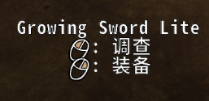

# 饥荒mod制作（day7）
---- 

## 物品的文字
1. 我们有了武器但是这个武器在游戏中还是显示不出名字的。
2. 我们需要在武器注册之前添加武器的名字：

```lua
    STRINGS.NAMES.GROWINGSWORDLITE = "Growing Sword Lite" -- 双引号之内是武器的名字
```
3. 但是这还是不够我们还需要可以调查他，
4. 在`fn`中添加组件`inventoryitem`，并且在武器注册之前添加检查的内容：

```lua
    STRINGS.CHARACTERS.GENERIC.DESCRIBE.GROWINGSWORDLITE = "Kill to be stronger, Switch on to boost attack damage."
```

### 效果如下：
 